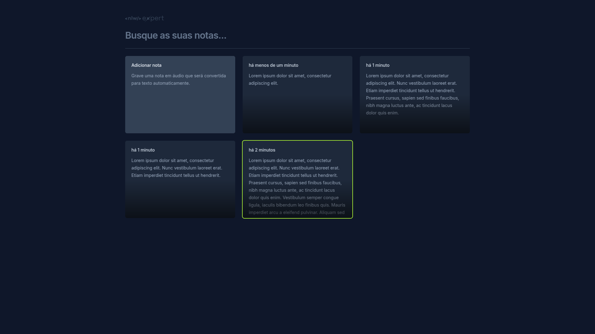

# 🗳️ NLW Expert Notes 📝
Este é um projeto de notas desenvolvido durante o evento NLW (Next Level Week) da Rocketseat 🚀. O aplicativo permite que os usuários criem, visualizem e excluam notas de maneira simples e eficiente.


## 🖼️ Demonstração




## 🔧 Tecnologias Utilizadas
* **React**: Biblioteca para construção de interfaces de usuário.
* **TypeScript**: Superset do JavaScript que adiciona tipagem estática.
* **Tailwind CSS**: Framework CSS utilitário para estilização rápida.
* **Vite**: Ferramenta de build rápida para projetos modernos de front-end.


## ⚠️ Pré-requisitos
Antes de rodar o projeto, certifique-se de ter as seguintes ferramentas instaladas em sua máquina:

* [Node.js](https://nodejs.org/en/download) (versão 18 ou superior)
* [Git](https://git-scm.com/)


##  🚀 Como Rodar o Projeto

1. ### Clone o repositório
   Primeiro, clone o repositório para a sua máquina local:
    ```bash
      git clone https://github.com/vitoriabarbosa/nlw-expert-notes.git
    ```
   
2. ### Instale as dependências
   Navegue até o diretório do projeto e instale as dependências necessárias com o npm:
    ```bash
      cd nlw-expert-notes
      npm install
    ```
   Isso irá instalar todas as dependências listadas no package.json do projeto 📦.

3. ### Execute o projeto
   Após a instalação das dependências, você pode iniciar o servidor de desenvolvimento:
    ```bash
      npm run dev
    ```
    Isso irá iniciar o Vite em modo de desenvolvimento e abrir o aplicativo no navegador 🌐.

4. ### Acesse o aplicativo
   Ao executar o projeto, no terminal irá aparecer o link de onde o projeto está rodando, basta clicar para visualizar o aplicativo 👀.


## 📜 Scripts
Aqui estão os scripts disponíveis para o projeto:

* 🚀 **npm run dev**: Inicia o servidor de desenvolvimento.
* 🔨 **npm run build**: Compila o projeto para produção.
* 👨‍💻 **npm run preview**: Visualiza a versão compilada em produção localmente.


## 📦 Dependências
O projeto utiliza as seguintes dependências:

### Dependências principais:
* `@radix-ui/react-dialog`: 1.0.5
* `date-fns`: 3.3.1
* `lucide-react`: 0.323.0
* `react`: 18.2.0
* `react-dom`: 18.2.0
* `sonner`: 1.4.0

### Dependências de desenvolvimento:
* `@types/dom-speech-recognition`: 0.0.4
* `@types/react`: 18.2.43
* `@types/react-dom`: 18.2.17
* `@vitejs/plugin-react`: 4.2.1
* `autoprefixer`: 10.4.17
* `postcss`: 8.4.35
* `tailwindcss`: 3.4.1
* `typescript`: 5.2.2
* `vite`: 5.0.8


Licença 📝
Este projeto está sob a licença MIT - veja o arquivo [LICENSE](LICENSE) para mais detalhes.